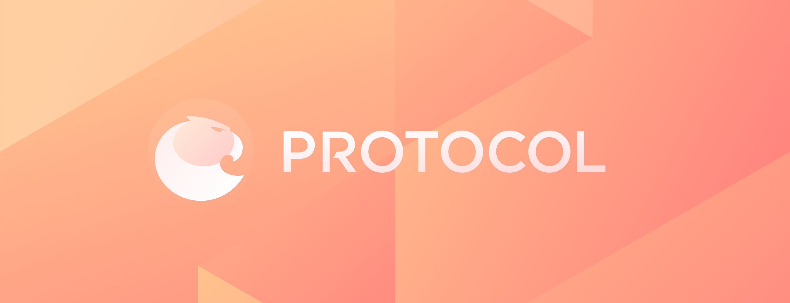

  <a href="https://github.com/aragon/protocol/actions"/>
</img>

## Project

#### 👩‍️ [Become an Aragon Protocol guardian](https://aragon.org/token/ant)
Aragon Protocol will soon be live on Ethereum mainnet. You can become a guardian by staking ANT.

#### ⚖ [Check out the Aragon Protocol Dashboard](https://protocol.aragon.org)
The Aragon Protocol Dashboard is the central app where all dispute-related information is available for guardians.

## Protocol

#### 📓 [Read the full documentation](/docs)
Aragon Protocol is a dispute resolution protocol running on Ethereum. It is the core component of the [Aragon Network](https://aragon.org/network/).

#### 🚧 Project stage: v1 implementation
After a long research and development phase, Aragon Protocol's v1 implementation will soon be released as an upgraded version of Aragon Court.

#### 🚨 Security review status: in progress
Aragon Protocol v1 is being audited by a security firm. We will publish the results as soon as we finish the process.

#### 👋 Get started contributing with a [good first issue](https://github.com/aragon/aragon-protocol/issues?q=is%3Aissue+is%3Aopen+label%3A%22good+first+issue%22)
Don't be shy to contribute even the smallest tweak. Everyone will be especially nice and helpful to beginners to help you get started!

## Deployed instances

#### Mainnet

The mainnet instance of Aragon Protocol will be deployed after we finish the security audit.

#### Testing

There are a few testing instances deployed of Aragon Protocol, please refer to the [testing guide](/docs/8-testing-guide) to have a better understanding on using these.

## Help shape Aragon Protocol
- Discuss in [Aragon Forum](https://forum.aragon.org/tags/dispute-resolution)
- Join the [Aragon Discord server](https://discord.com/invite/aragon).
