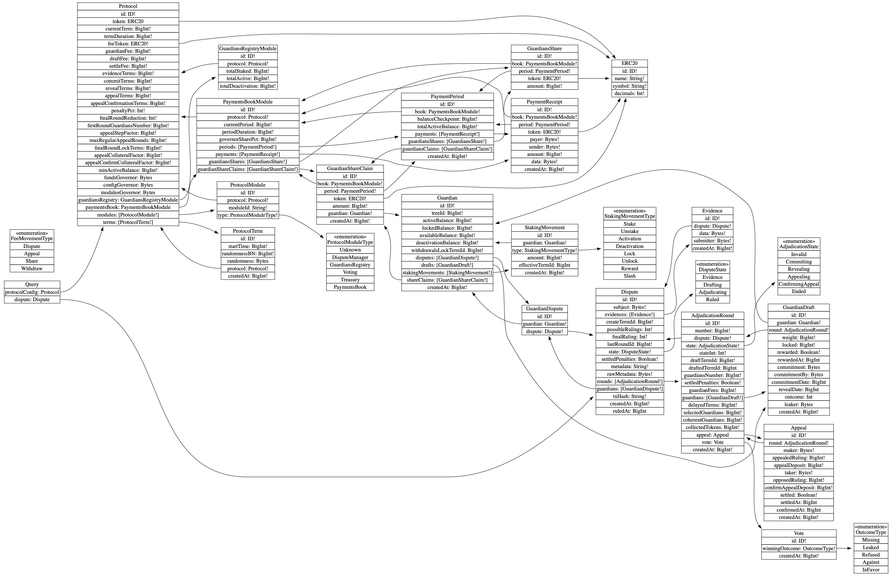

# Aragon Protocol subgraph

### Schema



### Remotes

1. [Mainnet](https://thegraph.com/explorer/subgraph/aragon/aragon-protocol-mainnet)
2. [Rinkeby](https://thegraph.com/explorer/subgraph/aragon/aragon-protocol-rinkeby)
3. [Ropsten](https://thegraph.com/explorer/subgraph/aragon/aragon-protocol-ropsten)
4. [Staging](https://thegraph.com/explorer/subgraph/aragon/aragon-protocol-staging)

### Local

To test the subgraph locally please do the following tasks

##### 1. Start local Aragon Protocol instance
First make sure to clone this repo and install dependencies:

```bash
git clone git@github.com:aragon/protocol.git
cd protocol
yarn
```

Then you will need a local Aragon Protocol instance running, to deploy one simply make sure you're placed in the root dir of the project and run:
 
```bash
yarn start
```

##### 2. Start Graph node
In another terminal, clone the graph node and start it:

```bash
git clone https://github.com/graphprotocol/graph-node/
cd graph-node/docker
rm -rf data
docker-compose up
```

(See [this issue](https://github.com/graphprotocol/graph-node/issues/1132) about the `setup.sh` script)

> If docker prompts you with the error `The reorg threshold 50 is larger than the size of the chain 7, you probably want to set the ETHEREUM_REORG_THRESHOLD environment variable to 0`,
  simply add a new env variable in `docker-compose.yml` named `ETHEREUM_REORG_THRESHOLD` assigning it to 0 and start it again.

##### 3. Deploy Aragon Protocol subgraph
You can use the provided deployment script to create a manifest file, providing the protocol deployed address as follows:

```bash
cd packages/subgraph
PROTOCOL=<PROTOCOL_ADDRESS> yarn deploy:ganache
```

Replace `PROTOCOL_ADDRESS` with the Aragon Protocol address outputted in the step 1. 

##### 4. Query Aragon Protocol subgraph

Open up the following URL to be able to query your graph using the provided GraphiQL console:

http://127.0.0.1:8000/subgraphs/name/aragon/aragon-protocol-ganache/graphql
